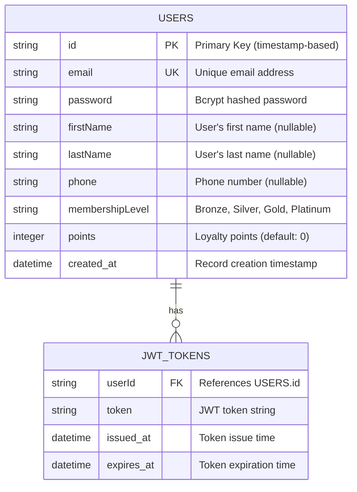
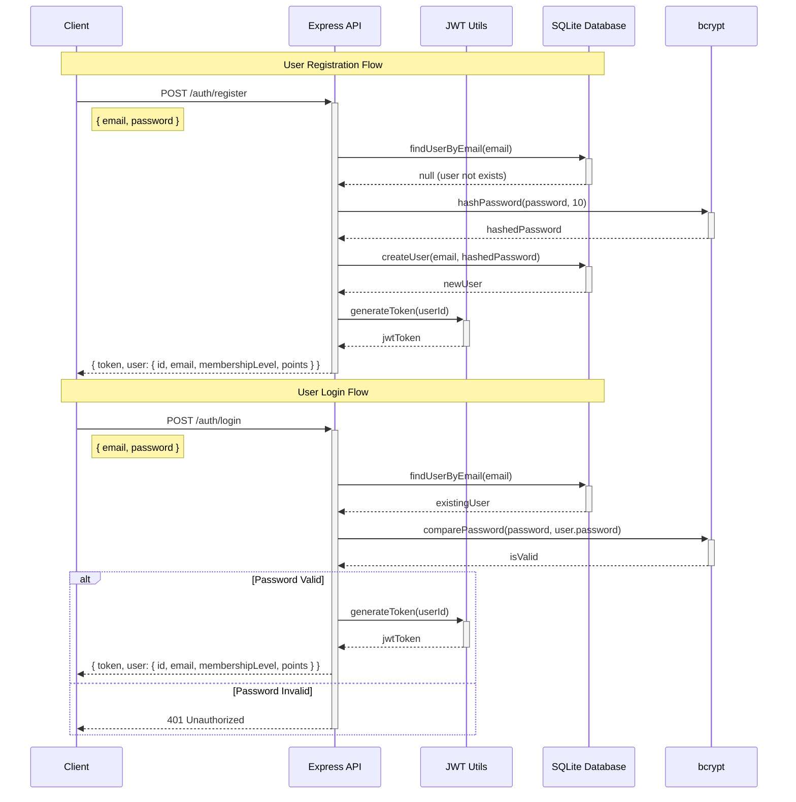
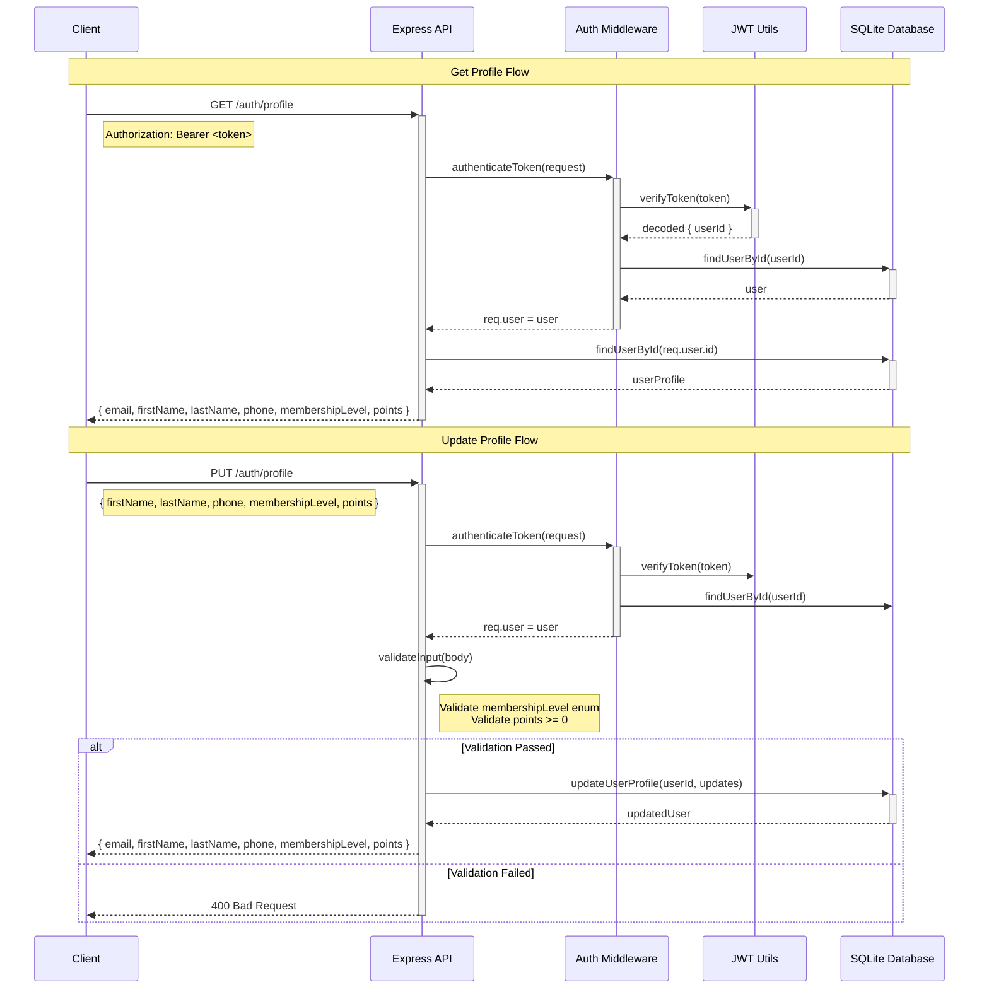
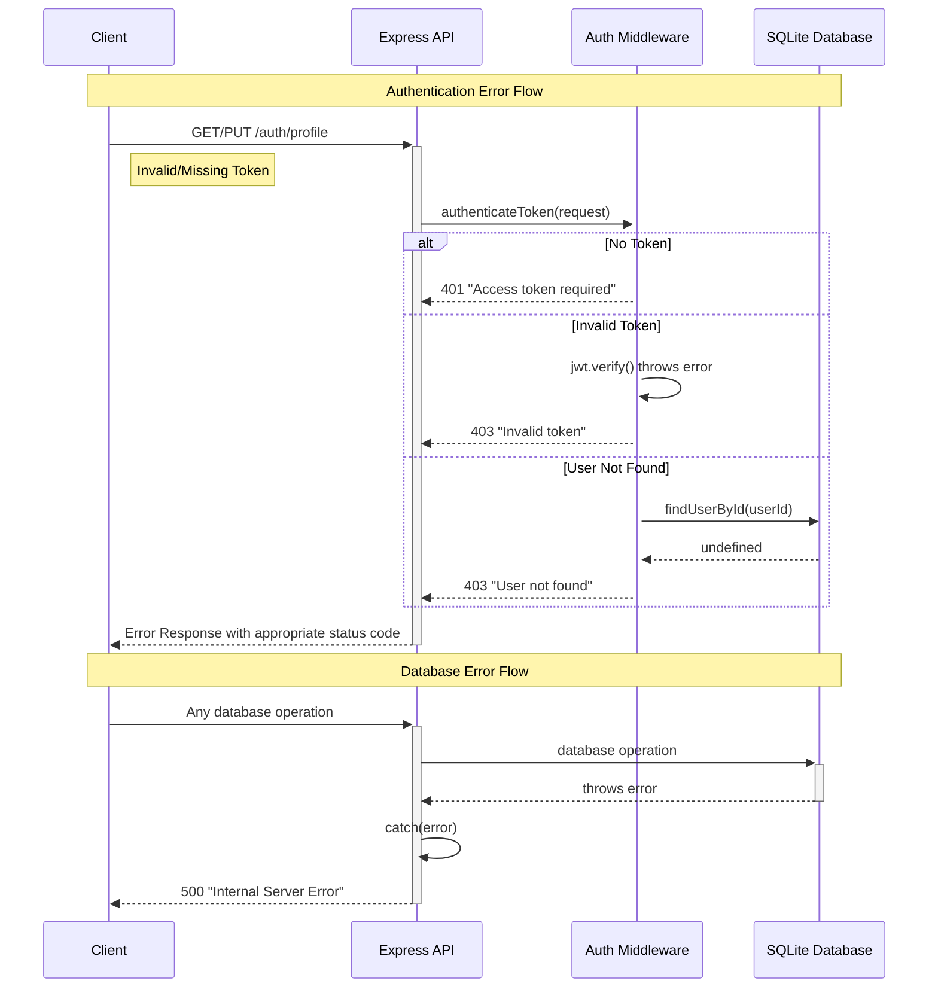

# Backend Workshop - RESTful API Documentation

## Overview
This document provides detailed technical documentation for the RESTful API built with Node.js, Express, TypeScript, JWT authentication, and SQLite database.

## System Architecture

### Technology Stack
- **Backend Framework**: Node.js + Express.js + TypeScript
- **Authentication**: JWT (JSON Web Tokens) with bcrypt password hashing
- **Database**: SQLite with sql.js library
- **Documentation**: Swagger/OpenAPI 3.0
- **Development**: nodemon, dotenv, CORS middleware

## Database Schema

### Entity Relationship Diagram



### Database Specifications
- **Primary Key**: Timestamp-based string ID for better scalability
- **Email Uniqueness**: Enforced at database level
- **Password Security**: bcrypt with 10 salt rounds
- **Membership Levels**: Enum validation (Bronze, Silver, Gold, Platinum)
- **Default Values**: membershipLevel='Bronze', points=0

## API Flows

### Authentication Flow - Register & Login



### Profile Management Flow



### Error Handling Flow



## Security Features

### Password Security
- **Hashing Algorithm**: bcrypt with 10 salt rounds
- **Storage**: Only hashed passwords stored, never plaintext
- **Validation**: Secure comparison using bcrypt.compare()

### JWT Token Security
- **Secret Key**: Environment variable (JWT_SECRET)
- **Expiration**: Configurable token lifetime
- **Validation**: Signature verification on every protected request
- **Payload**: Minimal data (userId only)

### Input Validation
- **Email Format**: RFC compliant email validation
- **Membership Levels**: Enum validation (Bronze, Silver, Gold, Platinum)
- **Points**: Non-negative integer validation
- **SQL Injection**: Prepared statements with parameterized queries

## API Endpoints Summary

### Authentication Endpoints
- `POST /auth/register` - User registration
- `POST /auth/login` - User authentication

### Profile Management Endpoints
- `GET /auth/profile` - Retrieve user profile (Protected)
- `PUT /auth/profile` - Update user profile (Protected)

### System Endpoints
- `GET /` - Health check endpoint
- `GET /api-docs` - Swagger documentation

## Database Operations

### User Management
```sql
-- Create user
INSERT INTO users (id, email, password, firstName, lastName, phone, membershipLevel, points, created_at) 
VALUES (?, ?, ?, ?, ?, ?, ?, ?, ?)

-- Find user by email
SELECT id, email, password, firstName, lastName, phone, membershipLevel, points, created_at 
FROM users WHERE email = ?

-- Find user by ID  
SELECT id, email, password, firstName, lastName, phone, membershipLevel, points, created_at 
FROM users WHERE id = ?

-- Update user profile
UPDATE users SET firstName = ?, lastName = ?, phone = ?, membershipLevel = ?, points = ? 
WHERE id = ?
```

### Schema Migration
The system includes automatic schema migration functionality that:
1. Detects missing columns on startup
2. Backs up existing user data
3. Recreates table with new schema
4. Restores user data with default values for new columns

## Error Codes and Messages

| Status Code | Error Type | Description |
|-------------|------------|-------------|
| 400 | Bad Request | Invalid input data or validation failure |
| 401 | Unauthorized | Missing or invalid authentication token |
| 403 | Forbidden | Valid token but user not found |
| 404 | Not Found | Requested resource not found |
| 409 | Conflict | Email already exists during registration |
| 500 | Internal Server Error | Database or server error |

## Sample API Usage

### Registration
```bash
curl -X POST http://localhost:3000/auth/register \
  -H "Content-Type: application/json" \
  -d '{"email":"user@example.com","password":"securepassword123"}'
```

### Login
```bash
curl -X POST http://localhost:3000/auth/login \
  -H "Content-Type: application/json" \
  -d '{"email":"user@example.com","password":"securepassword123"}'
```

### Get Profile
```bash
curl -X GET http://localhost:3000/auth/profile \
  -H "Authorization: Bearer YOUR_JWT_TOKEN"
```

### Update Profile
```bash
curl -X PUT http://localhost:3000/auth/profile \
  -H "Authorization: Bearer YOUR_JWT_TOKEN" \
  -H "Content-Type: application/json" \
  -d '{
    "firstName": "สมชาย",
    "lastName": "ใจดี", 
    "phone": "081-234-5678",
    "membershipLevel": "Gold",
    "points": 15420
  }'
```

## Development & Testing

### Environment Setup
1. Install dependencies: `npm install`
2. Create `.env` file with `JWT_SECRET` and `PORT`
3. Build project: `npm run build`
4. Start development server: `npm run dev`

### Testing
- Authentication tests: `node test-auth-detailed.js`
- Profile management tests: `node test-profile.js`
- Interactive API testing: Visit `http://localhost:3000/api-docs`

## Production Considerations

### Security Enhancements
- Rate limiting for authentication endpoints
- HTTPS enforcement
- Environment-specific CORS configuration
- JWT token refresh mechanism
- Password complexity requirements

### Performance Optimizations
- Database connection pooling
- Response caching for read operations
- Database indexing on frequently queried fields
- Request/response compression

### Monitoring & Logging
- Structured logging with appropriate log levels
- Authentication attempt monitoring
- Performance metrics collection
- Error tracking and alerting

---

*Generated on September 18, 2025 - RESTful API Workshop Documentation*